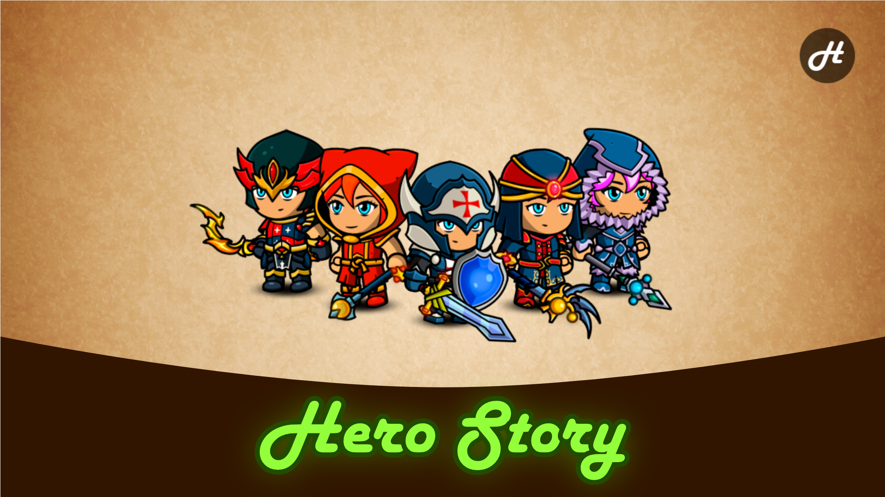

# HeroStory Game Server


A lightweight MMORPG game backend that supports multi-player online gameplay, character management, real-time communication, and combat logic expansion.  



## Quick Start
- Install dependencies
```bash
go mod tidy
```
- Start the server
```bash
go run ./cmd/biz_server
```
- Select a character
> http://cdn0001.afrxvk.cn/hero_story/demo/step020/index.html?serverAddr=127.0.0.1:12345

## License
Developed for learning purposes based on [hjj2017/hero_story.go_server](https://github.com/hjj2017/hero_story.go_server). For practice only.